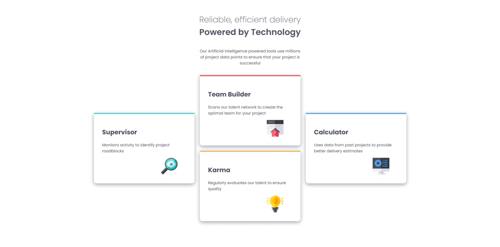

# Frontend Mentor - Four card feature section solution

This is a solution to the [Four card feature section challenge on Frontend Mentor](https://www.frontendmentor.io/challenges/four-card-feature-section-weK1eFYK). Frontend Mentor challenges help you improve your coding skills by building realistic projects. 

## Table of contents

- [Overview](#overview)
  - [Screenshot](#screenshot)
  - [Links](#links)
- [My process](#my-process)
  - [Built with](#built-with)
  - [What I learned](#what-i-learned)
  - [Continued development](#continued-development)
  - [AI Collaboration](#ai-collaboration)
- [Author](#author)
## Overview

### Screenshot



### Links

- Solution URL: [Frontend Mentor Solution](https://your-solution-url.com)
- Live Site URL: [Live Site](https://osmond20.github.io/Four-Card-Feature-Section/)

## My process

### Built with

- Semantic HTML5 markup
- CSS custom properties
- Flexbox
- CSS Grid
- Mobile-first workflow
- SCSS

### What I learned

I learned how to use CSS grid more in applying grid-column and grid-row, and also combining it with flexbox. It was quite the challenge however it was worth it because I managed to figure it out and complete the solution.

To see how you can add code snippets, see below:

```css
        padding-bottom: 0;
        grid-template-columns: repeat(3,385px);
        grid-template-rows: repeat(4,125px);
```

### Continued development

I will be focusing on getting better with responsive design especially with CSS grid and doing my best to get better at using it because I am still newbie at using it.

### AI Collaboration

Describe how you used AI tools (if any) during this project. This helps demonstrate your ability to work effectively with AI assistants.

- What tools did you use (e.g., ChatGPT, Claude, GitHub Copilot)? Github Copilot
- How did you use them (e.g., debugging, generating boilerplate, brainstorming solutions)? I used Github Copilot for debugging especially when I was encountering layout issues with the mobile and desktop design.
- What worked well? Using it as a guide.

## Author

- Website - [Github](https://github.com/osmond20)
- Frontend Mentor - [@osmond20](https://www.frontendmentor.io/profile/osmond20)
